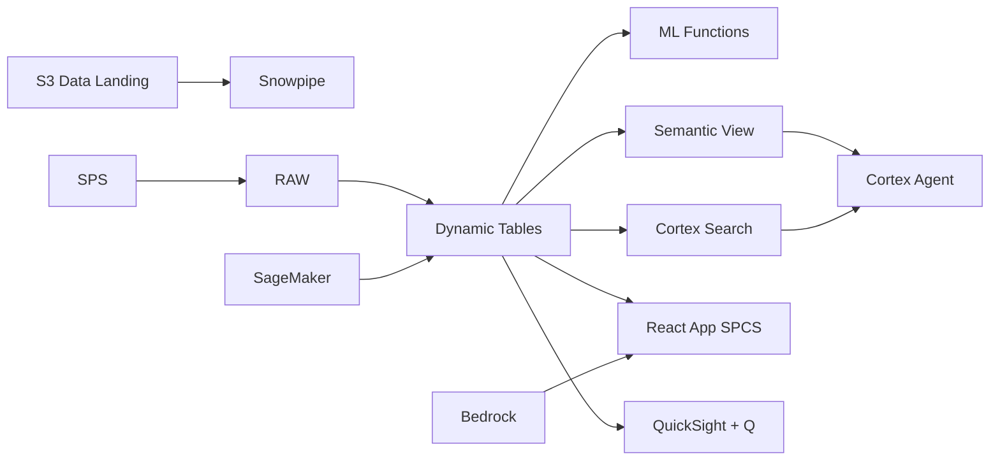

# Solar Farm Analytics

Solar Farm Analytics for Vietnam - ML.FORECAST and Dynamic Tables power real-time solar farm analytics intelligence for renewable energy in Ninh Thuan & Binh Thuan.

## Architecture

Vietnam renewable energy faces increasing complexity in solar farm analytics. Decision-makers in Ninh Thuan & Binh Thuan need real-time intelligence and ML-powered recommendations.



## Snowflake Capabilities

| Capability | Implementation |
|-----------|---------------|
| Dynamic Tables | PERFORMANCE_DASHBOARD / TREND_ANALYTICS / FORECAST_INPUT / OPERATIONAL_RISK |
| ML Functions | ML.FORECAST + ML.ANOMALY_DETECTION |
| Cortex AI | COMPLETE, SUMMARIZE, AI_CLASSIFY |
| Cortex Search | 100 documents indexed |
| Cortex Agent | SOLAR_ANALYTICS_AGENT |
| Semantic View | SOLAR_ANALYTICS_ANALYTICS |
| React App (SPCS) | 5 tabs + DemoGuide |


## AWS Services

| Service | Role in Demo |
|---------|-------------|
| AWS IoT Core | Ingest real-time data from renewable energy systems |
| Amazon SageMaker | Solar Farm Analytics ML models |
| AWS Glue | ETL and data transformation |
| Apache Iceberg (S3) | Open table format for data sharing |
| Amazon Bedrock (Claude) | Generate solar farm analytics recommendations |
| Amazon QuickSight + Q | Solar Farm Analytics dashboard with NL queries |


## Personas

| Persona | Role | Key Questions |
|---------|------|---------------|
| **Dr. Nguyen Van Phong** | VP Solar Operations | "What are the key solar farm analytics metrics?" "Which areas need attention?" |
| **Tran Thi Thao** | Performance Engineer | "Show me the trend analysis." "Which operations are underperforming?" |


## Data

| Table | Rows | Description |
|-------|------|-------------|
| OPERATIONS | 100,000 | Core operational records for solar farm analytics |
| METRICS | 500,000 | Time-series performance metrics |
| ASSETS | 5,000 | Asset and entity master data |
| EVENTS | 200,000 | Operational events and incidents |
| DOCUMENTS | 100 | SOPs, reports, and compliance docs |


## Build Instructions

### Prerequisites
- Snowflake account with ACCOUNTADMIN access
- Cortex AI enabled (ML Functions, Search, Agent)
- Warehouse: SOLAR_WH (Medium)
- AWS CLI with access (us-west-2)

### Deployment

```bash
snowsql -f snowflake/00_setup.sql
snowsql -f snowflake/01_marketplace_install.sql
snowsql -f snowflake/02_raw_tables.sql
snowsql -f snowflake/03_staging.sql
snowsql -f snowflake/04_dynamic_tables.sql
snowsql -f snowflake/05_search.sql
snowsql -f snowflake/06_ml_models.sql
snowsql -f snowflake/07_semantic_view.sql
snowsql -f snowflake/08_agent.sql
```

### React App (SPCS)
```bash
cd app && npm ci && npm run build
docker build -t aws-vietnam-renewable-solar-app .
docker push bdiqc8sm-default.registry.snowflakecomputing.com/solar_analytics/app/aws_vietnam_renewable_solar/app:latest
```

### Demo Mode
Open the app URL with `?demo=true` for presenter view.

## Build Modes

### Snowflake Only
Run scripts 00-08 (skip AWS-specific integration). Uses:
- **Snowpipe Streaming SDK** instead of AWS IoT Core
- **ML.FORECAST + ML.ANOMALY_DETECTION** instead of Amazon SageMaker
- **Dynamic Tables** instead of AWS Glue
- **Snowflake-managed Iceberg Tables** instead of Apache Iceberg (S3)
- **Cortex Complete** instead of Amazon Bedrock (Claude)
- **Snowflake Intelligence (Cortex Analyst)** instead of Amazon QuickSight + Q

### Full AWS + Snowflake
Run all scripts including AWS integration. Deploy QuickSight dashboard from `quicksight/`.

## Business Impact

Industry research and Snowflake customer outcomes:
- **Vietnam has 17GW of installed solar capacity — largest in Southeast Asia, 5th in Asia-Pacific** — [IRENA Renewable Capacity Statistics](https://www.irena.org/publications/2024/Mar/Renewable-capacity-statistics-2024)
- **Rooftop solar grew from 0 to 9.5GW in 2019-2021 — grid curtailment reached 30-40% due to oversupply** — [EVN Vietnam](https://www.evn.com.vn/d6/news/Annual-Report-2024-141-163-2.aspx)
- **Vietnam Power Development Plan 8 (PDP8) targets 20GW solar by 2030 requiring $15B investment** — [MOIT Vietnam](https://moit.gov.vn/en/news/energy-policy/pdp8-approved.html)
- **Uniper** (Snowflake customer): built a real-time energy trading and grid analytics platform on Snowflake managing 40GW of generation capacity -- [snowflake.com/customers/uniper](https://www.snowflake.com/en/customers/all-customers/case-study/uniper/)

## Key Demo Numbers

- **100K operations** tracked in Ninh Thuan & Binh Thuan
- **500K metrics** time-series data points
- **5K assets** monitored
- **100 docs** searchable


## License

Apache 2.0 — See [LICENSE](LICENSE) for details.

This is a personal demo project and is not an official Snowflake offering. It comes with no support or warranty.